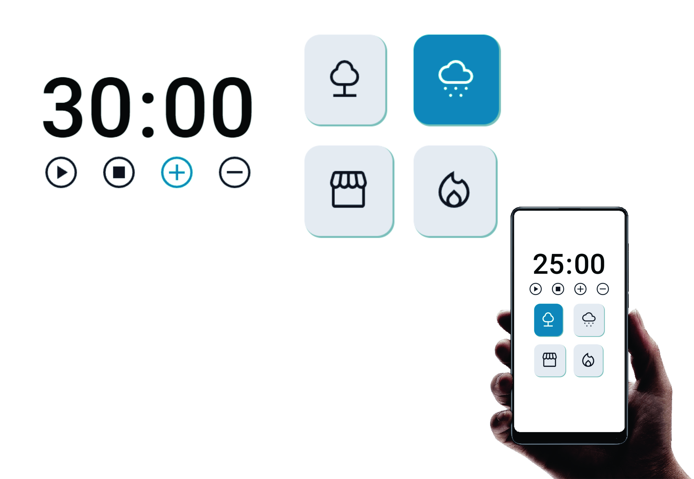

# Exercício 03 do nível 05 - Focus Timer 2.0

> <b>Trilha Explorer </b>

> Projeto feito para cumprir desafio 01 do nível 05 - <b>FocusTimer 2.0!</b> construído no curso Explorer da Rocketseat :rocket:. 

## :hammer_and_wrench: Tecnologias

- HTML
- CSS
- Javascript
- Git e Github

## :nut_and_bolt: Principais pontos abordados

### CSS
- display grid
- Centralizar os elementos HTML usando self

### Javascript
- DOM
- Event-driven, programação imperativa e callbacks
- Muita refatoração
- Clean Code
- Factory e Injeção de dependências
- Funções em Javascript
- Estrutura de dados com objetos;
- Estrutura de repetição;
- Operadores comparativos;

## :dart:  Desafio

:heavy_check_mark:  A ideia agora é criar o temporizador pomodoro FocusTimer 2.0!

Cada card que se encontra do lado direito, quando selecionado, vai mudar de cor e emitir um som diferente. Os sons você pode encontrar, respectivamente, nos links abaixo:

[**Floresta**](https://drive.google.com/file/d/1CRHkV72WUMdcqec5GT_KdsqFz0z3VAOA/view)

[**Chuva**](https://drive.google.com/file/d/1Ip8xBqAUJ-bty51Wz8JBtX_bWXCgA0P2/view)

[**Cafeteria**](https://drive.google.com/file/d/1OxLKpCwg2wrxXFNUHgZxJ51QEt0ac5RA/view)

[**Lareira**](https://drive.google.com/file/d/1MakaBPxJvTa_whaSM3kEbRcxiVd1GRCB/view)

Funcionalidades esperadas dos botões:

- [ Play ] .... aciona o timer;
- [ Stop ] ... para o timer;
- [ + ] .......... aumenta em mais 5 minutos o tempo do timer;
- [ - ] ........... diminui em 5 minutos o tempo do timer.

## Pomodoro 

A técnica pomodoro promete ajudar quem tem dificuldade em terminar as suas tarefas no prazo? Essa metodologia garante o fim desse ciclo vicioso e ainda aumentar sua produtividade. Trata-se de uma ferramenta simples e eficaz para que você gerencie o seu tempo.

### O que é a técnica Pomodoro?
A técnica, aliás, foi desenvolvida no final dos anos 80 pelo italiano Francesco Cirillo, que procurava uma maneira de aumentar sua produtividade nos estudos durante os primeiros anos de universidade. Para isso, ele utilizou um timer de cozinha para organizar suas tarefas.

Assim, seu timer tinha o formato de um tomate ***(pomodoro, em italiano)*** e girava durante 25 minutos, emitindo um barulho forte ao final desse prazo. Nesse meio tempo, Cirillo se concentrava nas suas tarefas sem interrupções (mesmo!), mantendo-se 100% focado. Ao perceber os resultados satisfatórios, divulgou sua técnica em 1992.

### Como funciona o Pomodoro?
A técnica se baseia na ideia de que dividindo o nosso fluxo de trabalho em blocos de concentração intensa, conseguimos melhorar a agilidade do cérebro e estimular nosso foco. Em outras palavras, melhoramos nossa gestão do tempo e ficamos mais eficientes. Portanto, para colocá-la em prática você vai precisar de:

- Timer ou cronômetro para fazer contagem regressiva 
- Uma lista de tarefas (“to-do-list”)
- Lápis e borracha

Primeiramente, você deve fazer uma lista de tarefas a serem desempenhadas durante o dia. Depois, basta dividir seu tempo em períodos de 25 minutos (chamados “pomodoros”) e trabalhar ininterruptamente em suas tarefas nesses períodos.

 Um dica é criar uma lista de tarefas e, se possível, estimar o tempo de duração de cada uma delas. Você pode escolher utilizar um template pronto ou fazer à mão.

Quando o timer tocar (ao fim dos primeiros 25 minutos), faça um X nas tarefas concluídas ou anote o status de seu trabalho (50% concluído, por exemplo) e faça um breve intervalo de 5 minutos. Nessa pausa, aproveite para fazer outras coisas não relacionadas à tarefa (ir ao banheiro, ligar para um cliente, tomar um café, etc). 

<i>["Recomendado: Como parar de procrastinar definitivamente – técnicas, aplicativos e livros"</i>](https://www.napratica.org.br/dicas-como-parar-de-procrastinar/)

A cada quatro ciclos, faça uma pausa maior (entre 15 e 30 minutos) para descansar. Esses intervalos entres os pomodoros são fundamentais para “oxigenar o seu cérebro” e aumentar a agilidade mental. Além disso, vale lembrar que essas medidas de tempo são apenas as sugeridas no método clássico. Nada impede que você encontre o seu próprio equilíbrio e período de descanso ideal. 

## :mailbox_closed: Contatos

> Email - rosendc30@gmail.com

> Linkedin - https://www.linkedin.com/in/francisco-rosendo-a05623241/
